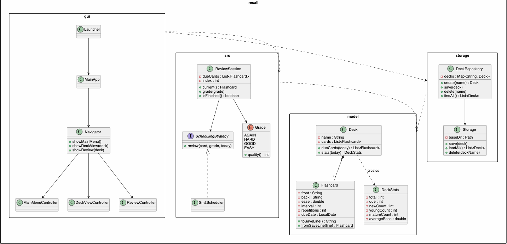
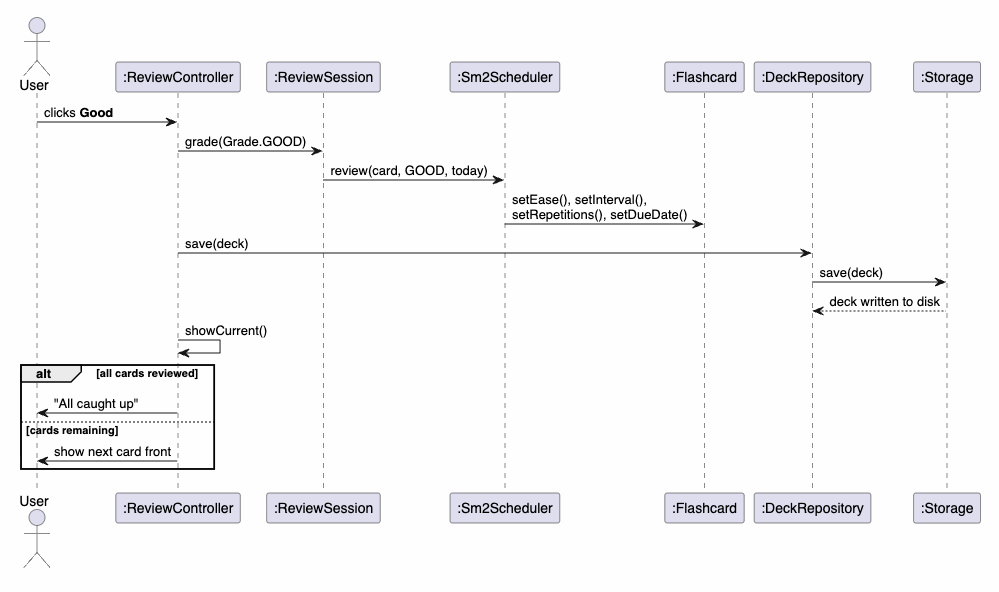

# Recall — Developer Guide

## 1. Overview
Recall is a JavaFX desktop application for spaced-repetition flashcard study. It
is organised into four packages/layers, with dependencies pointing inward toward
the domain model.

## 2. Setting up

### Prerequisites
- **JDK 17** or later. Check with `javac -version`.
- Gradle 7.6.2 is included via the wrapper, no separate install required.
- No separate JavaFX install is needed; Gradle downloads it automatically.

### Getting started
1. Clone the repository.
2. Run the tests to verify everything works:
   ```
   ./gradlew test
   ```
3. Run the application:
   ```
   ./gradlew run
   ```
4. Build a standalone JAR (includes all dependencies):
   ```
   ./gradlew shadowJar
   ```
   The JAR is produced at `build/libs/recall.jar`.

## 3. Architecture
This project follows a Model View Controller architecture

```
        View                    Controller                 Model
  +--------------+     +----------------------+    +-----------------+
  |  FXML files  |<----|  *Controller classes  |--->|  recall.model   |
  |  (resources/ |     |  Navigator, MainApp   |    |  recall.srs     |
  |   view/)     |     |  (recall.gui)         |    |  recall.storage |
  +--------------+     +----------------------+    +-----------------+
```

### Class diagram



- **recall.model** - the pure domain. `Flashcard` holds a card's content and its
  SM-2 state and serialises itself to and from a save line. `Deck` is a named
  list of cards with due-filtering, search, and statistics. `DeckStats` is an
  immutable snapshot of a deck's review stats. Depends on nothing but the JDK,
  and is fully unit-tested.
- **recall.srs** - spaced-repetition logic. `Sm2Scheduler` implements SM-2
  behind a `SchedulingStrategy` interface; `Grade` maps the four UI buttons to
  SM-2 quality values; `ReviewSession` walks a deck's due cards, applying grades.
- **recall.storage** - persistence. `Storage` reads/writes deck files;
  `DeckRepository` holds all decks in memory and coordinates persistence, and is
  the single object the UI talks to for deck operations.
- **recall.gui** - the JavaFX front end. Each screen is an FXML layout plus a
  controller; `Navigator` loads screens, injects dependencies, and swaps the
  scene root; `MainApp`/`Launcher` bootstrap the application.

### Request flow
A user action (e.g. grading a card) is handled by a controller method, which
updates the model through the srs layer, persists via the repository, and
refreshes the view. Navigation between screens goes through `Navigator`, which
passes the selected `Deck` from one controller to the next.

### Sequence diagram — grading a card



## 4. Key components

### Flashcard and the save format
Each card serialises to one line: `front|back|ease|interval|reps|dueDate`,
separated by `|`. Because card text may itself contain `|`, a backslash, or
newlines (multi-line answers), those characters are escaped on save and
unescaped on load, so a line always splits back into exactly six fields. `Deck`
and `DeckStats` compute due counts and maturity relative to a supplied "today"
date, keeping them deterministic and testable.

### The SM-2 scheduler
`Sm2Scheduler.review(card, grade, today)` updates a card following SM-2
(Woźniak, 1990):
- First successful review → interval 1 day; second → 6 days; thereafter →
  ceil(interval × ease).
- Ease is adjusted after every review by
  `EF' = EF + (0.1 − (5−q)(0.08 + (5−q)×0.02))`, floored at 1.3.
- A failing grade (**Again**, quality < 3) resets the repetition count and
  interval to a 1-day schedule.

**Documented decision.** The canonical description is ambiguous about ease on a
lapse: it says to adjust ease after *every* repetition, yet also says a failed
card restarts "without changing the E-Factor". Recall follows the widely-used
reference implementations and adjusts ease on every grade, isolating the choice
in one method so it can be changed. The alternative (leaving ease untouched on a
lapse) reduces "ease hell" but diverges from those implementations.

### Review sessions
`ReviewSession` snapshots a deck's due cards at construction and hands them out
one at a time. Grading the current card applies the scheduler and advances; the
session mutates cards but leaves persistence to the caller. It is a deliberately
simple single pass — a lapsed card is rescheduled rather than repeated within
the same session.

### Persistence and the repository
`Storage` writes one `<deckName>.txt` file per deck under a base directory that
is injected at construction (production uses `data/decks`; tests use a temporary
directory). A corrupted line is skipped with a warning rather than failing the
whole load. `DeckRepository` loads all decks at start-up, keeps them in memory,
and writes through to disk on every change; it validates deck names against
`[A-Za-z0-9 _-]+` and enforces case-insensitive uniqueness.

## 5. Design patterns
- **Model–View–Controller** - FXML files are the views, the `*Controller`
  classes the controllers, `recall.model` the model. Controllers hold no layout;
  views hold no logic.
- **Strategy** - `SchedulingStrategy` abstracts the scheduling algorithm, so
  `ReviewSession` depends on an interface rather than SM-2 specifically.
- **Repository** - `DeckRepository` is the single access point for the deck
  collection, hiding storage details from the UI.
- **Dependency injection via the Navigator** - controllers receive their
  collaborators through an `init(...)` call after the FXML loads, because the
  `@FXML` fields do not exist until then.

### Implementing a new scheduling algorithm
The Strategy pattern makes it straightforward to swap in a different scheduler:

1. Create a new class that implements `SchedulingStrategy`
   (`src/main/java/recall/srs/SchedulingStrategy.java`):
   ```java
   public class MyScheduler implements SchedulingStrategy {
       @Override
       public void review(Flashcard card, Grade grade, LocalDate today) {
           // update card.setEase(), card.setInterval(),
           // card.setRepetitions(), card.setDueDate()
       }
   }
   ```
2. In `Navigator.showReview()` (`src/main/java/recall/gui/Navigator.java`),
   replace `new Sm2Scheduler()` with `new MyScheduler()`.
3. No other code needs to change — `ReviewSession` and the controllers work
   through the `SchedulingStrategy` interface.

## 6. Testing
The domain and logic layers are covered by JUnit 5, run with `./gradlew test`:
- `FlashcardTest`, `DeckTest`, `DeckStatsTest` - model behaviour, serialisation
  round-trips (including the escape edge cases), due-filtering, and statistics.
- `Sm2SchedulerTest`, `ReviewSessionTest` - the SM-2 numbers (interval schedule,
  ease adjustments, floor, reset) and the session lifecycle.
- `StorageTest`, `DeckRepositoryTest` - disk round-trips using a JUnit
  `@TempDir`, malformed-line resilience, and deck-name validation.

The scheduler was built test-first, with expected interval and ease values taken
from the canonical SM-2 description. The GUI layer is verified manually against
the User Guide, since JavaFX rendering is not unit-tested.

### Manual GUI test cases

| # | Scenario | Steps | Expected result |
|---|----------|-------|-----------------|
| 1 | Create a deck | Type "Spanish" in the deck name box, click **Create** | Deck "Spanish" appears in the list |
| 2 | Duplicate deck name | Create "Spanish", then try to create "spanish" | Error message shown; no duplicate created |
| 3 | Delete a deck | Select a deck, click **Delete**, confirm in dialog | Deck removed from list and its file deleted from disk |
| 4 | Add a card | Enter front and back text, click **Add** | Card appears in the deck's card list |
| 5 | Add card with missing field | Leave the front or back box empty, click **Add** | Error message shown; card not added |
| 6 | Edit a card | Select a card, click **Edit card**, modify text, click **OK** | Card text updated in the list |
| 7 | Delete a card | Select a card, click **Delete card** | Card removed from the list |
| 8 | Review due cards | Open a deck with due cards, click **Review due cards**, grade all cards | "All caught up" message displayed |
| 9 | Review with no due cards | Click **Review due cards** on a deck with nothing due | "No cards due" message displayed |
| 10 | View statistics | Click **Stats** in deck view | Dialog shows total, due, new/young/mature counts, average ease |
| 11 | Exit mid-review | Grade some cards, click **Back to deck** | Graded cards are saved; ungraded cards remain unchanged |

## 7. Acknowledgements
- **Project scaffolding** - the Gradle wrapper, the `build.gradle` JavaFX/Shadow
  configuration, and the `Launcher`/`MainApp` bootstrap pattern were adapted from
  my CS2103T individual project: https://github.com/ludannnn/ip
- **SM-2 algorithm** - Woźniak, P. A. (1990), *Optimization of learning*, and the
  SuperMemo description of Algorithm SM-2:
  https://www.supermemo.com/en/archives1990-2015/english/ol/sm2
- **Card maturity convention** - the 21-day "mature card" threshold follows
  Anki's convention.
- **Libraries** - JavaFX 17 (UI) and JUnit 5 (testing).
- Development used an AI assistant (Claude) for design discussion, code
  generation, and algorithm verification; see `docs/Reflections.md` and `logs/`.